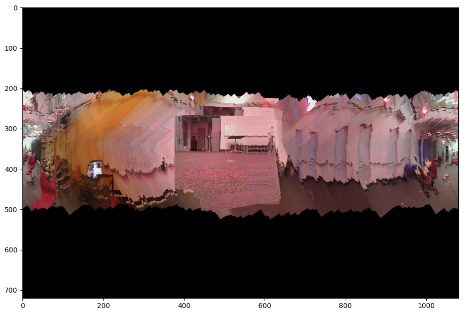

# Orientation Tracking and Panorama Generation

In this project, we implement a quaternion based orientation estimation and panorama generation using IMU and camera data. We optimize these estimates using PGD on the measurements from the IMU. These are then used to generate a stitched panorama image.



<e>*Figure 1: Panorama image generated from stitched camera frames using optimized orientation estimates.*</e>

## Installation

Follow the steps to setup the environment and install packages required to run this project.

```bash
conda create -n <ENV_NAME> python=3.8
conda activate <ENV_NAME>
pip install -r requirements.txt
pip install --upgrade "jax[cpu]"
```

## Folder Structure

The project is organized as follows:

```bash
.
├── data
│   ├── cam
│   ├── imu
│   └── vicon
├── img
├── utils.py
├── model.py
├── optimizer.py
├── panorama.py
├── quaternion.py
└── main.py
```

## Running the code
Use the following command to run the code.

```bash
python main.py --dataset <DATASET_NO>
```

Arguments:
- `--dataset <DATASET_NO>`: Select any dataset from `1`-`11`.
- `--alpha <ALPHA>` (*Optional* ) : Learning rate for the optimization (default: `0.001`)
- `--max_iter <MAX_ITER>` (*Optional* ) : Maximum iterations for the optimization (default: `100`)

Example:
```bash
python main.py --dataset 10 --alpha 0.001 --max_iter 80
```
